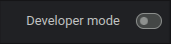
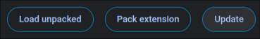
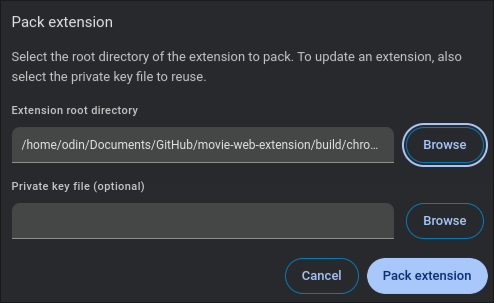
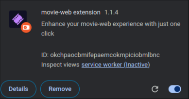
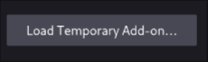

# movie-web extension

## Installation

Cloning :

```shell
git clone https://git.lonelil.com/movie-web/extension.git
cd extension
```

Install PNPM :

```shell
npm install -g pnpm
```

Install dependencies :

```shell
pnpm install
```

## Build :

For chromium browser :

```shell
pnpm build
```

For firefox browser :

```shell
pnpm build:firefox
```

## Pack extension :

### Chromium

Goto `chrome://extensions/`

In the top right-hand corner, activate developer mode





Click on Pack extension and enter the path to the build folder



This creates two files in the folder, a .crx and a .pem. You can drag and drop the .crx file directly into the `chrome://extensions/` page to install it. If it doesn't work see [Installation from an unpacked version](#installation-from-an-unpacked-version)
The .pem contains the private key that guarantees its integrity and authenticity. But for a personal installation we don't need it.

### Installation from an unpacked version


Click on load unpacked and enter the path to the build folder.



### Firefox

Goto `about:debugging#/runtime/this-firefox`



And load temporary addon