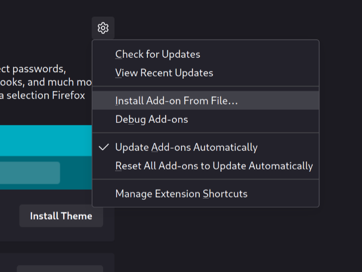

# movie-web extension

> [!IMPORTANT]  
> don't trust anyone: installing an extension that isn't signed by a trusted third party can access your private data.

## Installation

Cloning :

```shell
git clone https://git.lonelil.com/movie-web/extension.git
cd extension
```

Install PNPM :

```shell
npm install -g pnpm
```

Install dependencies :

```shell
pnpm install
```

## Build :

For chromium browser :

```shell
pnpm build
```

For firefox browser :

```shell
pnpm build:firefox
```

## Pack extension :

### Chromium

Goto `chrome://extensions/`

In the top right-hand corner, activate developer mode


Click on Pack extension and enter the path to the build folder


This creates two files in the folder, a .crx and a .pem. You can drag and drop the .crx file directly into the `chrome://extensions/` page to install it. If it doesn't work see [Installation from an unpacked version](#installation-from-an-unpacked-version)
The .pem contains the private key that guarantees its integrity and authenticity. But for a personal installation we don't need it.

### Installation from an unpacked version


Click on load unpacked and enter the path to the build folder.


### Firefox

Install web-ext :

```shell
npm install -g web-ext
```

Goto build path

```shell
web-ext build
```
create a zip file in `web-ext-artifacts/`

### Temporary method

Goto `about:debugging#/runtime/this-firefox`


And load temporary addon (zip file)

### Permanent method

> Install another version of firefox (tested on firefox dev edition) :

Unsigned extensions can be installed in the Developer Edition, Nightly, and ESR versions of Firefox, after toggling the `xpinstall.signatures.required` preference in `about:config`.

In `about:addons` install addon from file (zip file) :
